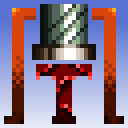
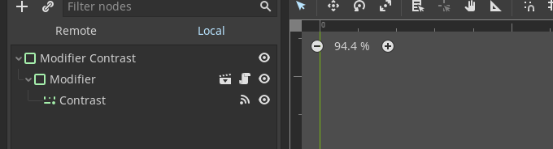
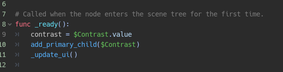
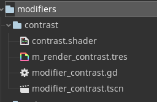

# Texrex 
## Open Source Texture Smasher

The #1 goal is to make the workflow for lofi primative 3d texturing easy, especially when working from borrowed source material

**App icon by Amon26, thanks!**

Some features i'd like:
- saving of project files, not just image export
- good crop tool, easy support for non-square ratios
- super good saving and loading workflow, no default Dialog guis!!
- painting layers
- a million weird effects and built-in pallettes

## Adding New Modifiers (WIP)
### Creating the scene
You'll need to create a new scene with a PanelContainer as the root element. Drag an instance of the modifier_base.tscn as a child of it. It will come with the modifier.gd base class attached, remove it and add your own in place. Your script will have to extend modifier to work. Any controls you want to have put inside the modifier will need to be

### Adding the controls to the modifier base slots
There are two functions to moving your custom controls inside the primary and secondary 'slots' of the modifier base:

`add_primary_child(node)`
and
`add_secondary_child(node)`

 These will simply reparent the nodes. Leaving other controls parented to the base scene will probably do weird stuff.

### Modifier files
its nice to put your modifiers in the same folder with a naming convention like this
